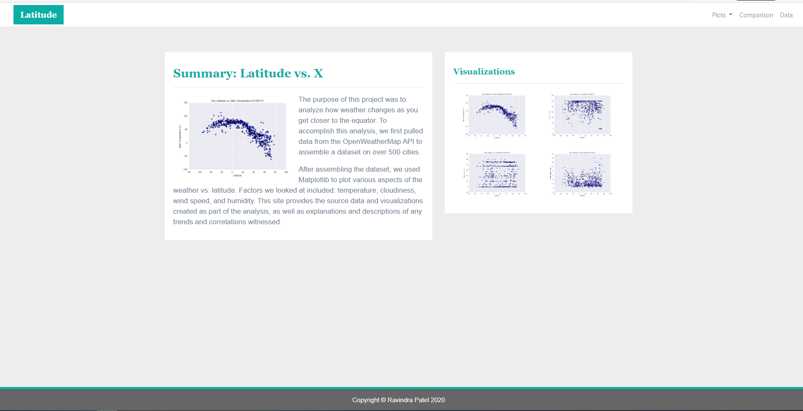
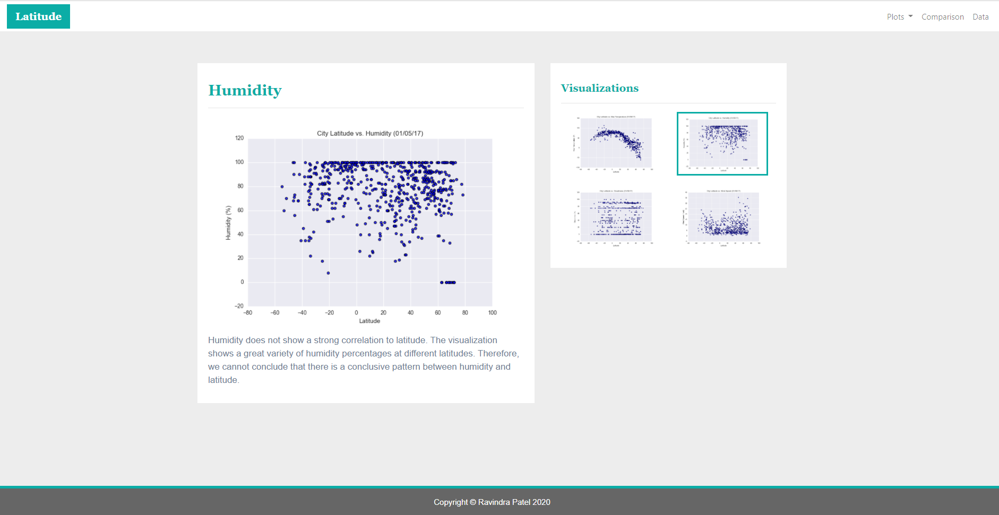
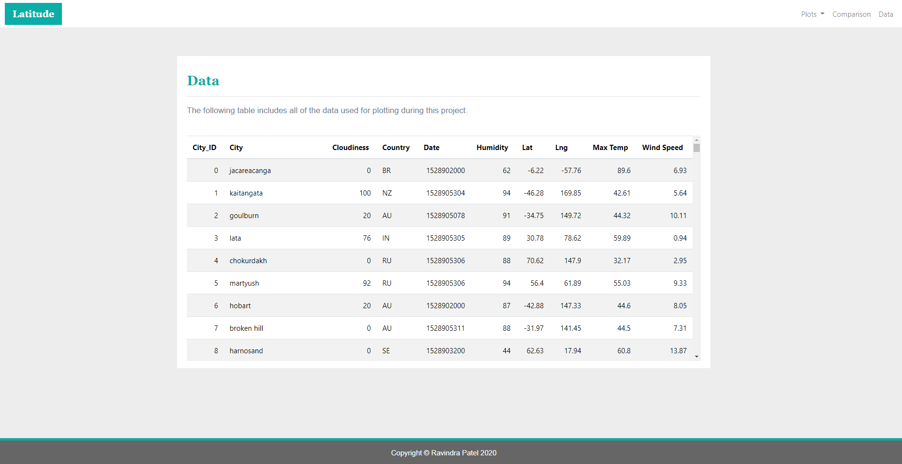
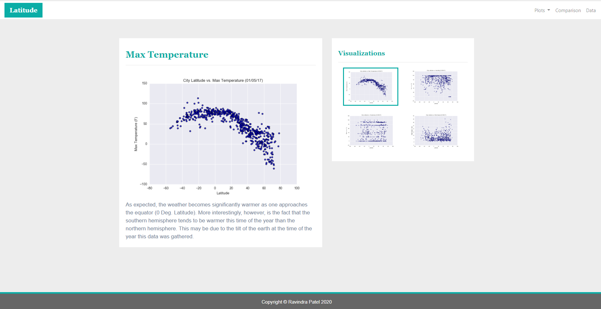
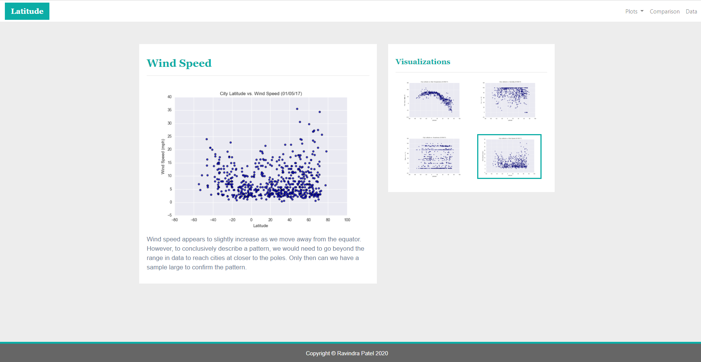

# Web-Design-Challenge

Web Visualization Dashboard of weather in 500+ cities at different latitudes relative to the equator line. The visualizations show temperature, humidity, cloudiness, and wind speed using HTML5, CSS3, and Bootstrap4.

## Summary

## Cloudiness

## Humidity

## Data

## Max Temperature

## Wind Speed

